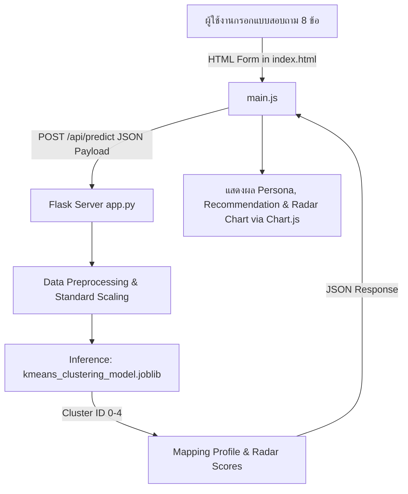

# 🗺️ Project Map & Architecture Documentation: Customer Persona Discovery Tool

เอกสารนี้วิเคราะห์และสรุปโครงสร้างของโปรเจกต์ **Customer Persona Discovery Tool** ซึ่งเป็นเว็บแอปพลิเคชันสำหรับวิเคราะห์และจัดกลุ่มบุคลิกภาพลูกค้า (Customer Segmentation/Persona Discovery) โดยใช้แบบจำลอง **K-Means Clustering** ร่วมกับข้อมูลแบบสำรวจ **World Values Survey (WVS Wave 7)**

---

## 📌 1. ภาพรวมโปรเจกต์ (Project Overview)

โปรเจกต์นี้เป็นการนำโมเดล Machine Learning (K-Means Clustering) ที่เทรนจากข้อมูลพฤติกรรม ทัศนคติ และสถานะทางการเงินของประชากร มาสร้างเป็น Interactive Web Application ให้ผู้ใช้งานกรอกแบบสอบถาม 8 ข้อ เพื่อทำนายและแนะนำ Persona, ข้อเสนอทางการตลาด (Marketing Strategy), และผลิตภัณฑ์ที่เหมาะสม พร้อมแสดง Radar Chart เปรียบเทียบคะแนนของผู้ใช้งานกับค่าเฉลี่ยของกลุ่ม

### 🛠️ Tech Stack & Tools

* **Backend Framework:** Python (Flask, Flask-CORS)
* **Machine Learning & Data Science:** Scikit-Learn (KMeans), Joblib, NumPy, Pandas
* **Frontend:** HTML5, Vanilla JavaScript (ES6+), Tailwind CSS (CDN), Chart.js (Radar Chart)
* **Data Source:** WVS Wave 7 (World Values Survey)

---

## 📁 2. โครงสร้างไฟล์และโฟลเดอร์ (Directory & File Structure)

```text
dataSci/
├── app.py                          # [Core Backend] Flask Web Application Server & Predict API
├── kmeans_clustering_model (1).joblib # [ML Model] Pre-trained KMeans Model (k=5 clusters)
├── map.md                          # [Doc] แผนผังและคำอธิบายโครงสร้างโปรเจกต์ (ไฟล์นี้)
├── guid.md                         # [Doc] ข้อกำหนด UI/UX, Feature Mapping และรายละเอียด Persona
├── analysis.txt                    # [Doc/Data] สรุปผลการวิเคราะห์ข้อมูลและการแจกแจง Cluster
├── requirements.txt                # [Config] รายการ Python Packages/Dependencies
│
├── templates/                      # [Frontend Templates]
│   └── index.html                  # หน้าจอหลักเว็บแอปพลิเคชัน (Form input & Results visualizer)
│
├── static/                         # [Frontend Assets]
│   └── js/
│       └── main.js                 # สคริปต์จัดการฟอร์ม, เรียก /api/predict และวาด Radar Chart
│
├── app/                            # [Deployment Package] โฟลเดอร์รวมซอร์สโค้ดฉบับคัดลอกพร้อมรัน
│   ├── app.py                      # สำเนา backend app.py
│   ├── kmeans_clustering_model (1).joblib # สำเนาไฟล์โมเดล
│   ├── static/                     # สำเนา static assets
│   └── templates/                  # สำเนา HTML templates
│
├── Notebook & Script Analysis Files/
│   ├── W7_Question.ipynb           # [Data Science] Jupyter Notebook หลักสำหรับการทำ EDA & Training
│   ├── notebook_extracted.py       # [Script] ซอร์สโค้ด Python ที่สกัดมาจาก Jupyter Notebook
│   ├── extract_notebook.py         # [Utility] สคริปต์สกัดโค้ดจาก .ipynb เป็น .py
│   ├── check_model.py              # [Utility] สคริปต์ตรวจสอบโครงสร้างและคุณสมบัติของโมเดล joblib
│   ├── approx_scaler.py            # [Utility] สคริปต์คำนวณและประมาณค่า Mean & Scale สำหรับ StandardScaler
│   ├── get_scaler_params.py        # [Utility] สคริปต์ดึงพารามิเตอร์การ Scale ข้อมูล
│   └── test_model.py               # [Testing] สคริปต์จำลองทดสอบการทำนาย 1,000 ตัวอย่าง
```

---

## ⚙️ 3. การทำงานของระบบ (System Architecture & Data Flow)



### 3.1 คุณลักษณะที่ใช้ในการวิเคราะห์ (8 Input Features)

| รหัสข้อถาม | ความหมาย / คำถามในระบบ | ช่วงค่า (Range / Value Mapping) |
| :--- | :--- | :--- |
| **Q3** | ความสำคัญของ "เวลาว่าง" ในชีวิต | 1 (สำคัญมาก) - 4 (ไม่สำคัญเลย) |
| **Q41** | ความคิดเห็นว่า "งานต้องมาก่อนเสมอ" | 1 (เห็นด้วยอย่างยิ่ง) - 4 (ไม่เห็นด้วยเลย) |
| **Q50** | ความพึงพอใจกับสถานะทางการเงิน | 1 (ไม่พอใจเลย) - 10 (พอใจมาก) |
| **Q288** | ระดับรายได้รวมของครอบครัว | 1 (ต่ำสุด) - 10 (สูงสุด) |
| **Q287** | ชนชั้นทางสังคม (ประเมินเอง) | 1 (Upper Class) - 5 (Lower Class) |
| **Q285** | เป็นผู้หารายได้หลักของครอบครัวหรือไม่ | 1 (ใช่), 2 (ไม่ใช่ / mapped เป็น 0/1) |
| **Q286** | สถานะเงินออมของครอบครัวในปีที่ผ่านมา | 3 (ออมได้), 2 (พอใช้), 1 (ต้องกู้ยืม) |
| **hobby_membership** | เป็นสมาชิกกลุ่มกีฬา/นันทนาการ/ศิลปะ | 1 (เป็น), 0 (ไม่เป็น) |

---

## 🎯 4. รายละเอียด Customer Personas ทั้ง 5 กลุ่ม (Cluster Profiles)

1. **Cluster 0: The Leisure-First Dreamer**
   * *คำอธิบาย:* รักอิสระ ให้ความสำคัญกับความสุขส่วนตัว แต่การเงินยังไม่มั่นคง
   * *กลยุทธ์การตลาด:* "เติมเต็มความสุขวันนี้ โดยไม่ต้องรอให้รวย"
   * *สินค้าแนะนำ:* บริการสตรีมมิ่ง, ท่องเที่ยวแนวประหยัด, สินค้าแฟชั่นราคาเข้าถึงง่าย

2. **Cluster 1: The Vulnerable Spendthrift**
   * *คำอธิบาย:* สายสังคมตัวจริง ชอบทำกิจกรรม แต่มีภาระการเงินสูงหรือเงินออมน้อย
   * *กลยุทธ์การตลาด:* "สนุกกับชีวิตได้เต็มที่ พร้อมตัวช่วยจัดการทุกค่าใช้จ่าย"
   * *สินค้าแนะนำ:* สินค้าผ่อน 0%, บัตรเครดิตสะสมแต้ม/ร้านอาหาร, ประกันภัยเบี้ยต่ำ

3. **Cluster 2: The Financially Secure Elite**
   * *คำอธิบาย:* เศรษฐีเงียบ มีรากฐานการเงินแข็งแรงมาก แต่ไม่เน้นโอ้อวด
   * *กลยุทธ์การตลาด:* "คุณค่าที่ยั่งยืน สำหรับผู้ที่เลือกสิ่งที่ดีที่สุดให้ตัวเอง"
   * *สินค้าแนะนำ:* กองทุนรวม/การลงทุนระยะยาว, สินค้าสุขภาพพรีเมียม, Quiet Luxury Brands

4. **Cluster 3: The Hard-Working Hustler**
   * *คำอธิบาย:* นักสู้เพื่อความสำเร็จ งานต้องมาก่อน และชอบเข้าสังคมเพื่อคอนเนกชัน
   * *กลยุทธ์การตลาด:* "เครื่องมือสู่ความสำเร็จ สำหรับคนที่ไม่เคยหยุดพัฒนา"
   * *สินค้าแนะนำ:* Gadget รุ่นท็อป, คอร์สสัมมนาธุรกิจ, อาหารเสริมบำรุงสมอง, บริการ Concierge

5. **Cluster 4: The Aspirational Underdog**
   * *คำอธิบาย:* มีความทะเยอทะยานสูง แคร์ภาพลักษณ์และสถานะสังคมมากกว่ารายได้จริง
   * *กลยุทธ์การตลาด:* "ก้าวสู่ตัวตนที่เหนือกว่า ยกระดับชีวิตคุณในทุกย่างก้าว"
   * *สินค้าแนะนำ:* สินค้าแบรนด์เนมรุ่นเริ่มต้น (Entry-luxury), คอร์สพัฒนาบุคลิกภาพ, สินค้าที่เป็นกระแส

---

## 🚀 5. คำแนะนำสำหรับการเรียกใช้งานโปรเจกต์ (Run Guide)

1. **การติดตั้ง Dependencies:**
   ```bash
   pip install -r requirements.txt
   ```

2. **การสั่งรัน Flask Web Server:**
   ```bash
   python app.py
   ```
   *เข้าใช้งานผ่าน Browser ที่:* `http://127.0.0.1:5000`
